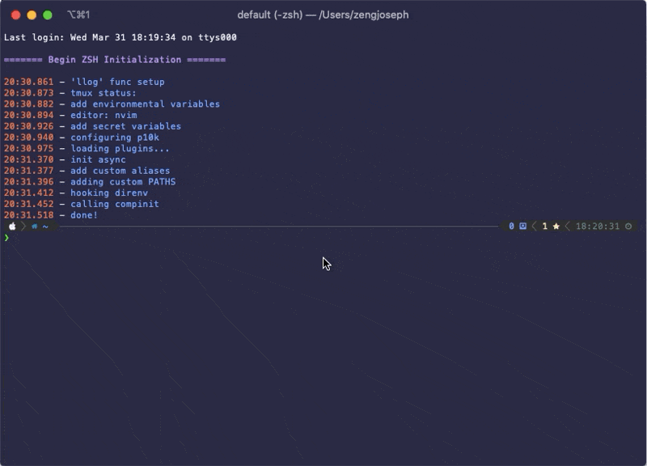

# Poets

A small script that goes over the directories of the current directories, and print them
`ls`-like, but also showing descriptions scraped to the best of the script's abilities



## Getting Started

Installation with pip

```bash
$ pip install poetspy
```

Installation with pipx

```bash
$ pipx install poetspy
```

## Usage

`cd` into your directory containing all your projects, then `pt`
